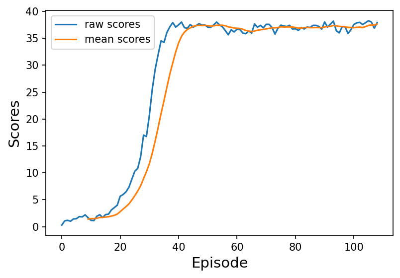

# Continuous Control

---

In this notebook, you will learn how to use the Unity ML-Agents environment for the second project of the [Deep Reinforcement Learning Nanodegree](https://www.udacity.com/course/deep-reinforcement-learning-nanodegree--nd893) program.

### 1. Start the Environment

We begin by importing the necessary packages.  If the code cell below returns an error, please revisit the project instructions to double-check that you have installed [Unity ML-Agents](https://github.com/Unity-Technologies/ml-agents/blob/master/docs/Installation.md) and [NumPy](http://www.numpy.org/).


```python
%load_ext autoreload
%autoreload 2

from unityagents import UnityEnvironment
import numpy as np

from collections import deque
import pandas as pd
import matplotlib.pyplot as plt
import torch

from ddpg_agent import Agent

%matplotlib inline

plt.ion()
```

Next, we will start the environment!  **_Before running the code cell below_**, change the `file_name` parameter to match the location of the Unity environment that you downloaded.

- **Mac**: `"path/to/Reacher.app"`
- **Windows** (x86): `"path/to/Reacher_Windows_x86/Reacher.exe"`
- **Windows** (x86_64): `"path/to/Reacher_Windows_x86_64/Reacher.exe"`
- **Linux** (x86): `"path/to/Reacher_Linux/Reacher.x86"`
- **Linux** (x86_64): `"path/to/Reacher_Linux/Reacher.x86_64"`
- **Linux** (x86, headless): `"path/to/Reacher_Linux_NoVis/Reacher.x86"`
- **Linux** (x86_64, headless): `"path/to/Reacher_Linux_NoVis/Reacher.x86_64"`

For instance, if you are using a Mac, then you downloaded `Reacher.app`.  If this file is in the same folder as the notebook, then the line below should appear as follows:
```
env = UnityEnvironment(file_name="Reacher.app")
```


```python
# env = UnityEnvironment(file_name='Reacher-one.app')
env = UnityEnvironment(file_name='Reacher-twenty.app')
```

    INFO:unityagents:
    'Academy' started successfully!
    Unity Academy name: Academy
            Number of Brains: 1
            Number of External Brains : 1
            Lesson number : 0
            Reset Parameters :
    		goal_speed -> 1.0
    		goal_size -> 5.0
    Unity brain name: ReacherBrain
            Number of Visual Observations (per agent): 0
            Vector Observation space type: continuous
            Vector Observation space size (per agent): 33
            Number of stacked Vector Observation: 1
            Vector Action space type: continuous
            Vector Action space size (per agent): 4
            Vector Action descriptions: , , , 


Environments contain **_brains_** which are responsible for deciding the actions of their associated agents. Here we check for the first brain available, and set it as the default brain we will be controlling from Python.


```python
# get the default brain
brain_name = env.brain_names[0]
brain = env.brains[brain_name]
```

### 2. Examine the State and Action Spaces

In this environment, a double-jointed arm can move to target locations. A reward of `+0.1` is provided for each step that the agent's hand is in the goal location. Thus, the goal of your agent is to maintain its position at the target location for as many time steps as possible.

The observation space consists of `33` variables corresponding to position, rotation, velocity, and angular velocities of the arm.  Each action is a vector with four numbers, corresponding to torque applicable to two joints.  Every entry in the action vector must be a number between `-1` and `1`.

Run the code cell below to print some information about the environment.


```python
# reset the environment
env_info = env.reset(train_mode=True)[brain_name]

# number of agents
num_agents = len(env_info.agents)
print('Number of agents:', num_agents)

# size of each action
action_size = brain.vector_action_space_size
print('Size of each action:', action_size)

# examine the state space 
states = env_info.vector_observations
state_size = states.shape[1]
print('There are {} agents. Each observes a state with length: {}'.format(states.shape[0], state_size))
print('The state for the first agent looks like:', states[0])
```

    Number of agents: 20
    Size of each action: 4
    There are 20 agents. Each observes a state with length: 33
    The state for the first agent looks like: [ 0.00000000e+00 -4.00000000e+00  0.00000000e+00  1.00000000e+00
     -0.00000000e+00 -0.00000000e+00 -4.37113883e-08  0.00000000e+00
      0.00000000e+00  0.00000000e+00  0.00000000e+00  0.00000000e+00
      0.00000000e+00  0.00000000e+00 -1.00000000e+01  0.00000000e+00
      1.00000000e+00 -0.00000000e+00 -0.00000000e+00 -4.37113883e-08
      0.00000000e+00  0.00000000e+00  0.00000000e+00  0.00000000e+00
      0.00000000e+00  0.00000000e+00  5.75471878e+00 -1.00000000e+00
      5.55726624e+00  0.00000000e+00  1.00000000e+00  0.00000000e+00
     -1.68164849e-01]


### 3. Train the Policy


```python
def ddpg(n_episodes=10000, max_t=1000, print_freq=100, average_score_cutoff=30):
    
    scores_deque = deque(maxlen=print_freq)
    scores = []
    
    for i_episode in range(1, n_episodes+1):
        env_info = env.reset(train_mode=True)[brain_name]
        states = env_info.vector_observations  
        agent.reset()
        score = np.zeros(num_agents)
        
        for t in range(max_t):
            actions = agent.act(states)            
            env_info = env.step(actions)[brain_name]   
            next_states = env_info.vector_observations         # get next state (for each agent)
            rewards = env_info.rewards                         # get reward (for each agent)
            dones = env_info.local_done                        # see if episode finished

            agent.step(states, actions, rewards, next_states, dones)
            states = next_states
            score += rewards
            
            if any(dones):
                break

        # Calculate Scores
        episode_score = np.mean(score)
        scores_deque.append(episode_score)
        scores.append(episode_score)
        average_score = np.mean(scores_deque)
        
        print(
            '\rEpisode {}\tAverage Score: {:.2f}\tCurrent Score: {:.2f}'.format(
                i_episode, average_score, episode_score
            ),
            end="",
        )

        if i_episode % print_freq == 0:
            print(
                '\rEpisode {}\tAverage Score: {:.2f}\tCurrent Score: {:.2f}'.format(
                    i_episode, average_score, episode_score)
            )
            
        if average_score >= average_score_cutoff:
            print('\nEnvironment solved in {:d} episodes!\tAverage Score: {:.2f}'.format(i_episode, average_score))
            torch.save(agent.actor_local.state_dict(), 'checkpoint_actor.pth')
            torch.save(agent.critic_local.state_dict(), 'checkpoint_critic.pth')
            break
            
    return scores
```


```python
# Create Agent
agent = Agent(
    state_size=state_size,
    action_size=action_size,
    n_agents=num_agents,
    random_seed=42
)
```


```python
# Train
trained_scores = ddpg(print_freq=100, average_score_cutoff=30.0)
```

    Episode 100	Average Score: 26.85	Current Score: 36.60
    Episode 109	Average Score: 30.12	Current Score: 37.92
    Environment solved in 109 episodes!	Average Score: 30.12


### 4. Plot the scores from training


```python
plt.figure(dpi=150)

# Raw scores
plt.plot(trained_scores, label="raw scores")

# Rolling mean
rolling_mean = pd.Series(trained_scores).rolling(10).mean()
plt.plot(rolling_mean, label="mean scores")

plt.legend()
plt.xlabel("Episode", fontsize=14)
plt.ylabel("Scores", fontsize=14)
plt.savefig("scores_results.jpg", bbox_inches='tight')
```


    

    


### 5. Watch the trained Agent perform


```python
agent.actor_local.load_state_dict(
    torch.load('checkpoint_actor.pth')
)
agent.critic_local.load_state_dict(
    torch.load('checkpoint_critic.pth')
)
```


```python
env_info = env.reset(train_mode=False)[brain_name]     # reset the environment    
states = env_info.vector_observations                  # get the current state (for each agent)
scores = np.zeros(num_agents)                          # initialize the score (for each agent)

while True:
    actions = agent.act(states)                        # choose action given state
    actions = np.clip(actions, -1, 1)                  # all actions between -1 and 1
    env_info = env.step(actions)[brain_name]           # send all actions to tne environment
    next_states = env_info.vector_observations         # get next state (for each agent)
    rewards = env_info.rewards                         # get reward (for each agent)
    dones = env_info.local_done                        # see if episode finished
    scores += env_info.rewards                         # update the score (for each agent)
    states = next_states                               # roll over states to next time step
    
    if np.any(dones):                                  # exit loop if episode finished
        break

print('Total score (averaged over agents) this episode: {}'.format(np.mean(scores)))
```

    Total score (averaged over agents) this episode: 37.699999157339334


When finished, you can close the environment.


```python
env.close()
```


```python

```
