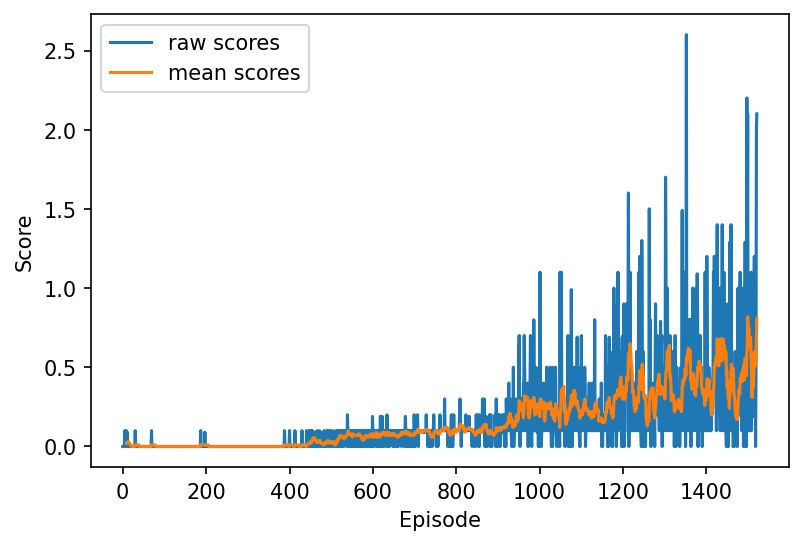

# Collaboration and Competition

---

In this notebook, you will learn how to use the Unity ML-Agents environment for the third project of the [Deep Reinforcement Learning Nanodegree](https://www.udacity.com/course/deep-reinforcement-learning-nanodegree--nd893) program.

### 1. Start the Environment

We begin by importing the necessary packages.  If the code cell below returns an error, please revisit the project instructions to double-check that you have installed [Unity ML-Agents](https://github.com/Unity-Technologies/ml-agents/blob/master/docs/Installation.md) and [NumPy](http://www.numpy.org/).


```python
%load_ext autoreload
%autoreload 2

from unityagents import UnityEnvironment
import numpy as np

from collections import deque
import pandas as pd
import matplotlib.pyplot as plt
import torch

from ddpg_agent import MultiAgents
import random
import pandas as pd
import torch

%matplotlib inline

plt.ion()
```


```python
torch.set_num_threads(6) # Intra-op parallelism
```

Next, we will start the environment!  **_Before running the code cell below_**, change the `file_name` parameter to match the location of the Unity environment that you downloaded.

- **Mac**: `"path/to/Tennis.app"`
- **Windows** (x86): `"path/to/Tennis_Windows_x86/Tennis.exe"`
- **Windows** (x86_64): `"path/to/Tennis_Windows_x86_64/Tennis.exe"`
- **Linux** (x86): `"path/to/Tennis_Linux/Tennis.x86"`
- **Linux** (x86_64): `"path/to/Tennis_Linux/Tennis.x86_64"`
- **Linux** (x86, headless): `"path/to/Tennis_Linux_NoVis/Tennis.x86"`
- **Linux** (x86_64, headless): `"path/to/Tennis_Linux_NoVis/Tennis.x86_64"`

For instance, if you are using a Mac, then you downloaded `Tennis.app`.  If this file is in the same folder as the notebook, then the line below should appear as follows:
```
env = UnityEnvironment(file_name="Tennis.app")
```


```python
env = UnityEnvironment(file_name="Tennis.app")
```

    INFO:unityagents:
    'Academy' started successfully!
    Unity Academy name: Academy
            Number of Brains: 1
            Number of External Brains : 1
            Lesson number : 0
            Reset Parameters :
    		
    Unity brain name: TennisBrain
            Number of Visual Observations (per agent): 0
            Vector Observation space type: continuous
            Vector Observation space size (per agent): 8
            Number of stacked Vector Observation: 3
            Vector Action space type: continuous
            Vector Action space size (per agent): 2
            Vector Action descriptions: , 


Environments contain **_brains_** which are responsible for deciding the actions of their associated agents. Here we check for the first brain available, and set it as the default brain we will be controlling from Python.


```python
# get the default brain
brain_name = env.brain_names[0]
brain = env.brains[brain_name]
```

### 2. Examine the State and Action Spaces

In this environment, two agents control rackets to bounce a ball over a net. If an agent hits the ball over the net, it receives a reward of +0.1.  If an agent lets a ball hit the ground or hits the ball out of bounds, it receives a reward of -0.01.  Thus, the goal of each agent is to keep the ball in play.

The observation space consists of 8 variables corresponding to the position and velocity of the ball and racket. Two continuous actions are available, corresponding to movement toward (or away from) the net, and jumping. 

Run the code cell below to print some information about the environment.


```python
# reset the environment
env_info = env.reset(train_mode=True)[brain_name]

# number of agents 
num_agents = len(env_info.agents)
print('Number of agents:', num_agents)

# size of each action
action_size = brain.vector_action_space_size
print('Size of each action:', action_size)

# examine the state space 
states = env_info.vector_observations
state_size = states.shape[1]
print('There are {} agents. Each observes a state with length: {}'.format(states.shape[0], state_size))
print('The state for the first agent looks like:', states[0])
```

    Number of agents: 2
    Size of each action: 2
    There are 2 agents. Each observes a state with length: 24
    The state for the first agent looks like: [ 0.          0.          0.          0.          0.          0.
      0.          0.          0.          0.          0.          0.
      0.          0.          0.          0.         -6.65278625 -1.5
     -0.          0.          6.83172083  6.         -0.          0.        ]


### 3. Take Random Actions in the Environment

In the next code cell, you will learn how to use the Python API to control the agents and receive feedback from the environment.

Once this cell is executed, you will watch the agents' performance, if they select actions at random with each time step.  A window should pop up that allows you to observe the agents.

Of course, as part of the project, you'll have to change the code so that the agents are able to use their experiences to gradually choose better actions when interacting with the environment!


```python
# for i in range(1, 6):                                      # play game for 5 episodes
#     env_info = env.reset(train_mode=False)[brain_name]     # reset the environment    
#     states = env_info.vector_observations                  # get the current state (for each agent)
#     scores = np.zeros(num_agents)                          # initialize the score (for each agent)
#     while True:
#         actions = np.random.randn(num_agents, action_size) # select an action (for each agent)
#         actions = np.clip(actions, -1, 1)                  # all actions between -1 and 1
#         env_info = env.step(actions)[brain_name]           # send all actions to tne environment
#         next_states = env_info.vector_observations         # get next state (for each agent)
#         rewards = env_info.rewards                         # get reward (for each agent)
#         dones = env_info.local_done                        # see if episode finished
#         scores += env_info.rewards                         # update the score (for each agent)
#         states = next_states                               # roll over states to next time step
#         if np.any(dones):                                  # exit loop if episode finished
#             break
#     print('Score (max over agents) from episode {}: {}'.format(i, np.max(scores)))
```

### 4. It's Your Turn!

Now it's your turn to train your own agent to solve the environment!  When training the environment, set `train_mode=True`, so that the line for resetting the environment looks like the following:
```python
env_info = env.reset(train_mode=True)[brain_name]
```

### 5. Train the Agent


```python
# Create Agent
agents = MultiAgents(
    state_size=state_size,
    action_size=action_size,
    num_agents=num_agents,
    random_seed=0,
)
```


```python
def train_ddpg(n_episodes=1000, print_freq=100, average_score_cutoff=0.5):
    
    scores_deque = deque(maxlen=print_freq)
    scores = []
    
    for i_episode in range(n_episodes+1):
        env_info = env.reset(train_mode=True)[brain_name]
        states = env_info.vector_observations
        score = np.zeros(num_agents)
        
        # Reset agents at the beginning of each episode
        agents.reset()
    
        while True:
            actions = agents.act(states)                 # Perform action
            env_info = env.step(actions)[brain_name]    # Get environment info
            next_states = env_info.vector_observations  # get next state (for each agent)
            rewards = env_info.rewards                  # get reward (for each agent)
            dones = env_info.local_done                 # see if episode finished

            agents.step(states, actions, rewards, next_states, dones)
            
            states = next_states
            score += rewards
            
            if any(dones):
                break
        
        max_score = np.max(score)
        scores_deque.append(max_score)
        scores.append(max_score)
        average_score = np.mean(scores_deque)
        
        print(
            '\rEpisode {}\tAverage Score: {:.4f}'.format(i_episode, average_score),
            end="",
        )
        
        if i_episode % print_freq == 0:
            print('\rEpisode {}\tAverage Score: {:.4f}'.format(i_episode, average_score))
        
        if average_score >= average_score_cutoff:
            print('\nEnvironment solved in {:d} episodes!\tAverage Score: {:.4f}'.format(i_episode, average_score))
            agents.save_weights()
            break
            
    return scores
```


```python
# Train
trained_scores = train_ddpg(
    n_episodes=10000,
    print_freq=100, 
    average_score_cutoff=0.5,
)
```

    Episode 0	Average Score: 0.0000
    Episode 100	Average Score: 0.0049
    Episode 200	Average Score: 0.0019
    Episode 300	Average Score: 0.0000
    Episode 400	Average Score: 0.0020
    Episode 500	Average Score: 0.0203
    Episode 600	Average Score: 0.0614
    Episode 700	Average Score: 0.0771
    Episode 800	Average Score: 0.0946
    Episode 900	Average Score: 0.1036
    Episode 1000	Average Score: 0.2036
    Episode 1100	Average Score: 0.2513
    Episode 1200	Average Score: 0.2466
    Episode 1300	Average Score: 0.3487
    Episode 1400	Average Score: 0.4042
    Episode 1500	Average Score: 0.4717
    Episode 1521	Average Score: 0.5046
    Environment solved in 1521 episodes!	Average Score: 0.5046


```python
plt.figure(dpi=150)

# Raw scores
plt.plot(trained_scores, label="raw scores")

# Rolling mean
rolling_mean = pd.Series(trained_scores).rolling(10).mean()
plt.plot(rolling_mean, label="mean scores")

plt.xlabel("Episode")
plt.ylabel("Score")
plt.legend()
```


    <matplotlib.legend.Legend at 0x7fdeddbbe5f8>


    

    


## 5. Watch the trained Agent perform


```python
for i, agent in enumerate(agents.agents):
    agent.actor_local.state_dict(torch.load(f'agent{i}_checkpoint__actor.pth'))
    agent.critic_local.state_dict(torch.load(f'agent{i}_checkpoint__critic.pth'))
```


```python
for i in range(1, 6):                                      # play game for 5 episodes
    env_info = env.reset(train_mode=False)[brain_name]     # reset the environment    
    states = env_info.vector_observations                  # get the current state (for each agent)
    scores = np.zeros(num_agents)                          # initialize the score (for each agent)

    while True:
        actions = agents.act(states)                  # select an action (for each agent)
        actions = np.clip(actions, -1, 1)                  # all actions between -1 and 1
        env_info = env.step(actions)[brain_name]           # send all actions to tne environment
        next_states = env_info.vector_observations         # get next state (for each agent)
        rewards = env_info.rewards                         # get reward (for each agent)
        dones = env_info.local_done                        # see if episode finished
        scores += env_info.rewards                         # update the score (for each agent)
        states = next_states                               # roll over states to next time step

        if np.any(dones):                                  # exit loop if episode finished
            break

    print('Score (max over agents) from episode {}: {}'.format(i, np.max(scores)))
```

    Score (max over agents) from episode 1: 0.20000000298023224
    Score (max over agents) from episode 2: 0.10000000149011612
    Score (max over agents) from episode 3: 1.0000000149011612
    Score (max over agents) from episode 4: 0.5000000074505806
    Score (max over agents) from episode 5: 0.4000000059604645


When finished, you can close the environment.


```python
# env.close()
```
